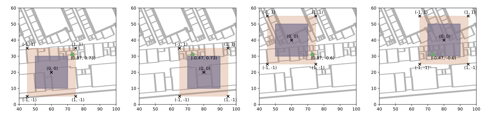

### Multi-Task Neural Network for Position Estimation in Large-Scale Indoor Environments


This repository holds the implementation of the neural network model for multi-task indoor localization (building/floor/position)
estimation in a single forward pass, which was proposed in:

M. Laska and J. Blankenbach, "Multi-Task Neural Network for Position Estimation in Large-Scale Indoor Environments," in IEEE Access, vol. 10, pp. 26024-26032, 2022, doi: [10.1109/ACCESS.2022.3156579](https://ieeexplore.ieee.org/document/9727182). 

It is demonstrated how to apply it on the [giaIndoorLoc]() dataset as described in the paper [VI-SLAM2tag](), in which the dataset was introduced together with its generation procedure.

#### Installation

Clone the repository and install the required packages as listed in the ```requirements.txt``` file.
Installation via any virtual environment such as *virtualenv* or *conda* are is strongly recommended. 

#### Dataset integration

For training the network on the giaIndoorLoc dataset, it has to be downloaded [here]() and placed in the ```datasets``` folder.

#### Train network

To train the mCEL network, a ```config.yml``` file has to be set up. Example files that have been used to create the evaluation
described in the [VI-SLAM2tag]() paper are contained in the ```config``` folder. Any parameter not specified in the ```config.yml```
will be taken from the default values given in ```default_params.py```.

#### Reproduce results of VI-SLAM2tag paper

In order to reproduce the results from the VI-SLAM2tag paper, the pre-trained model weights have to be downloaded [here]() and execute
the script ```run_exp.sh```.
You can also set the ```pretrained: False``` in the ```default_params.py``` file and train the model from scratch.
Note that this might result in slightly different results as the training is dependent on the hardware and the tensorflow version.
The pretrained models have been obtained via tensorflow==2.7.0 trained on a Macbook Pro with M1Pro chip (CPU-only).

#### Model/dataset extension
The repository has been designed to also provide easy integration with other datasets and models.
You have to provide a:
- dataset connector: which extracts the data and stores it in the specified format of the repository (please see source file documentation for details)
- data provider: transforms the raw data of a dataset connector to the format required by the model
- model: has to implement setup and evaluation function and might overwrite the fit function. 