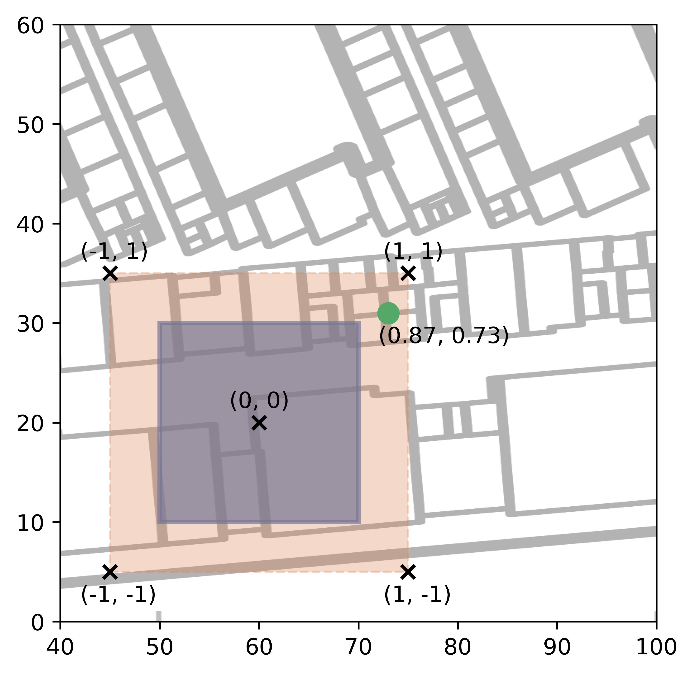

## Multi-Task Neural Network for Position Estimation in Large-Scale Indoor Environments

This repository holds the implementation of the neural network model for multi-task indoor localization (building/floor/position)
estimation in a single forward pass, which was proposed in:


> [1] M. Laska and J. Blankenbach, "Multi-Task Neural Network for Position Estimation in Large-Scale Indoor Environments," in IEEE Access, vol. 10, pp. 26024-26032, 2022, doi: [10.1109/ACCESS.2022.3156579](https://ieeexplore.ieee.org/document/9727182). 

> Pedestrian localization within large-scale multi-building/multi-floor indoor environments
remains a challenging task. Fingerprinting-based approaches are particularly suited for such large-scale
deployments due to their low requirements of hardware installments. Recently, the fingerprinting problem
has been addressed by deep learning. Existing models are mostly task specific by providing floor
classification or position estimation within a small area. A strategy to support localization within large-scale
environments is to sequentially apply hierarchical models. This has several drawbacks including missing
scalability and increased deployment complexity on smartphones. We propose a unifying approach based
on training a single neural network that classifies the building/floor and predicts the position in a single
forward-pass of the network. Our model classifies a grid cell and performs within grid cell regression,
which solves the performance degradation of applying regression within large areas. To reduce the error
in case of misclassified grid cells, we propose a novel technique called multi cell encoding learning
(multi-CEL), where a model simultaneously learns several redundant position representations within an
overlapping grid cell encoding. For three public WLAN fingerprinting datasets, we demonstrate that
multi-CEL surpasses existing state-of-the-art multi-task learning neural networks and even outperforms
regression neural networks explicitly trained for 2D-positioning by up to 17%.

The network simultaneously classifies a grid cell and perform within grid cell regression to obtain a final position estimate. This neural network architecture for this is as follows:
<p align="middle">
    
</p>
This allows for obtaining a floor/building classification (by the location of the classified grid cell) as well as a precise position estimate via the regression head via a single forward 
pass of the network. The combination of grid cell classification and within grid cell regression is also more accurate than directly performing regression over the entire floor of a given building as
demonstrated in the paper.

To prevent large errors in case of failures of the grid cell classification head, we introduced the multi-cell encoding learning (m-CEL) technique.
The network is supplied with several redundant encodings by letting the encoding grid slightly overlap. 
<p>
    
     
    
    
</p>
Via m-CEL the network is guided towards also learning the alternative encoding, such that the regression head produces a reasonable estimate in case that the classification head classifies an alternative grid-cell. 
This further improves the accuracy of the final position estimate.

### Installation

Clone the repository and install the required packages as listed in the ```requirements.txt``` file.
Installation via any virtual environment such as *virtualenv* or *conda* are is strongly recommended. 

### Dataset integration

The repository allows for training all models on various datasets. It provides access to the following datasets:
- giaIndoorLoc [2] (available [here](https://www.dropbox.com/sh/gayegcskeyzc5pa/AAB1hSg3aHuBKAJmv5geqfKba?dl=0))
- Tampere dataset [3] (available [here](https://zenodo.org/record/889798#.YnJC_hNBztU))
- UJI dataset [4] (available [here](https://archive.ics.uci.edu/ml/datasets/ujiindoorloc))
- UTS dataset [5] (available [here](https://github.com/XudongSong/CNNLoc-Access/tree/master/UTSIndoorLoc))

The downloaded datasets have to placed in the corresponding ```datasets/{dataset}/``` folders.
Please inspect the provided example config files inside the ```config``` folder for details on how to select the downloaded datasets for model training.

### Train and evaluate network

To train the mCEL network, a ```config.yml``` file has to be set up. Example files are contained in the ```config``` folder. Any parameter not specified in the ```config.yml```
will be taken from the default values given in ```config/default_params.py```.
Afterwards the pipelines specified within the config file can be executed via
```shell
python pipeline.py -c path/to/config.yml
```

### Visualization of predictions
The predictions of the models can be visualized and displayed along with the ground truth position for each fingerprint of the test partition of the dataset.
Just add the flag ```--visualize_predictions``` when executing a pipeline as
```shell
python pipeline.py -c path/to/config.yml --visualize_predictions
```
For each prediction a plotting window such as  

will open. Once the window is closed, the predictions for the next fingerprint of the test dataset will be shown and so on.
Visualization is only supported for the datasets that include a floorplan, which are the giaIndoorLoc and the Tampere dataset.
The floorplan images of the Tampere dataset have been extracted from the original article [3] that was published under Creative Commons Attribution License.

### Reproduce results of VI-SLAM2tag paper

In order to reproduce the results from the VI-SLAM2tag paper [2], the pre-trained model weights have to be downloaded [here](https://www.dropbox.com/sh/m6m0ar69t8pftg6/AAAi18FfTR93pIJGJE8Uq8pga?dl=0), place the 
```exp``` folder within the root of the directory and execute the script ```run_exp.sh```.
You can also set the ```pretrained: False``` in the ```default_params.py``` file and train the model from scratch.
Note that this might result in slightly different results as the training is dependent on the hardware and the tensorflow version.
The pretrained models have been obtained via tensorflow==2.8.0 trained on a Macbook Pro with M1Pro chip (CPU-only).

### Reproduce results of multi-CEL paper

To reproduce the results of the original paper run the experiments within the ```config/{dataset}``` for each dataset. Note that this only
provides the results of proposed model and not those of the reference SIMO architecture proposed by Kim et al. [6], since this would bloat the repository.
However, open-source implementations of their architecture can be found in their [github repository](https://github.com/kyeongsoo/dnn-based_indoor_localization), which we have used to reproduce the results.
Further, this repository does not cover the 2D-CNN-based backbone implementation for the same reasons. Note that the results might slightly differ from those reported in the paper
depending on the hardware the model was trained on. The experiments reported in the paper have been obtained by training on an NVIDIA GTX 1050 Ti and Tensorflow version 2.3. 

### Model and dataset extension
The repository has been designed to also provide easy integration with other datasets and models.
You have to provide the following:
- Dataset connector: which extracts the data and stores it in the specified format of the repository (please see source file documentation for details)
- Data provider: transforms the raw data of a dataset connector to the format required by the model
- Model: has to implement setup and evaluation function and might overwrite the fit function.

Please study the documented source code for details.

### References

[1] M. Laska und J. Blankenbach, „Multi-Task Neural Network for Position Estimation in Large-Scale Indoor Environments“, IEEE Access, Bd. 10, S. 26024–26032, 2022, doi: 10.1109/ACCESS.2022.3156579.

[2] Submitted to IPIN 22

[3] E. Lohan et al., „Wi-Fi Crowdsourced Fingerprinting Dataset for Indoor Positioning“, Data, Bd. 2, Nr. 4, S. 32, Okt. 2017, doi: 10.3390/data2040032.

[4] J. Torres-Sospedra et al., „UJIIndoorLoc: A new multi-building and multi-floor database for WLAN fingerprint-based indoor localization problems“, in 2014 International Conference on Indoor Positioning and Indoor Navigation (IPIN), Busan, South Korea, Okt. 2014, S. 261–270. doi: 10.1109/IPIN.2014.7275492.

[5] X. Song et al., „A Novel Convolutional Neural Network Based Indoor Localization Framework With WiFi Fingerprinting“, IEEE Access, Bd. 7, S. 110698–110709, Aug. 2019, doi: 10.1109/access.2019.2933921.

[6] K. S. Kim, „Hybrid Building/Floor Classification and Location Coordinates Regression Using A Single-Input and Multi-Output Deep Neural Network for Large-Scale Indoor Localization Based on Wi-Fi Fingerprinting“, in 2018 Sixth International Symposium on Computing and Networking Workshops (CANDARW), Takayama, Nov. 2018, S. 196–201. doi: 10.1109/CANDARW.2018.00045.
 